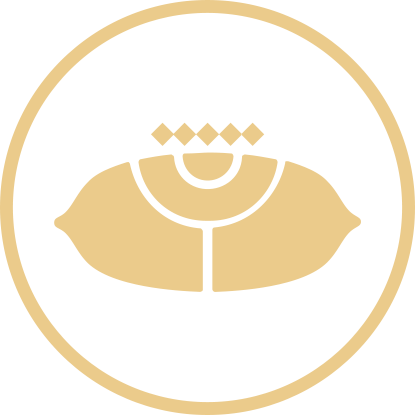

---  
activity_type:  
  - Raid  
activity_name: Deep Stone Crypt  
aliases:  
  - Deep Stone Intro  
tags:  
  - intro  
share: "true"  
---  
  
## Table of Contents  
  
[Encounters](0.%20Intro%20to%20Deep%20Stone%20Crypt.mdencounters)  
[Mechanics](0.%20Intro%20to%20Deep%20Stone%20Crypt.mdmechanics)  
[Bonus Chests](0.%20Intro%20to%20Deep%20Stone%20Crypt.mdbonus-chests)  
  
---  
  
## Encounters  
  
[Sparrow](./1.%20Sparrow.md)  
[Crypt Security](./2.%20Crypt%20Security.md)  
[Atraks-1, Fallen Exo](./3.%20Atraks-1,%20Fallen%20Exo.md)  
[Rapture](./4.%20Rapture.md)  
[Taniks, the Abomination](./5.%20Taniks,%20the%20Abomination.md)  
  
---  
  
## Mechanics  
  
DSC builds upon a few mechanics throughout the raid. These are primarily through color coded augments (roles) you can pick up through terminals.  
  
They are:  
  
> [!columns|clean no-t flex 3 ]  
>  
> > [!note|clean no-title ctr txt-c]  
> >   
> > **Operator**  
> > Shoots things like panels  
>  
> > [!note|clean no-title ctr txt-c]  
> >   
> > **Scanner**  
> > Looks for glowing points of interest  
>  
> > [!note|clean no-title ctr txt-c]  
> >   
> > **Suppressor**  
> > Stands under drones and shoots a boss or two  
  
These are dropped by vandal hackers that will appear with the symbol of the augment appearing over their head. Guardians will also have these symbols above them when picked up.  
  
Augments are swapped between various terminals throughout each encounter, there are typically three within reach at any time.  
  
---  
  
## Bonus Chests  
  
1. On a pillar by the last dome of the sparrow section.  
2. On the left side of one of the floating bits of the space walk section.  
  
---  
  
Don't forget to [check out the rest of what I have!](../../index.md)